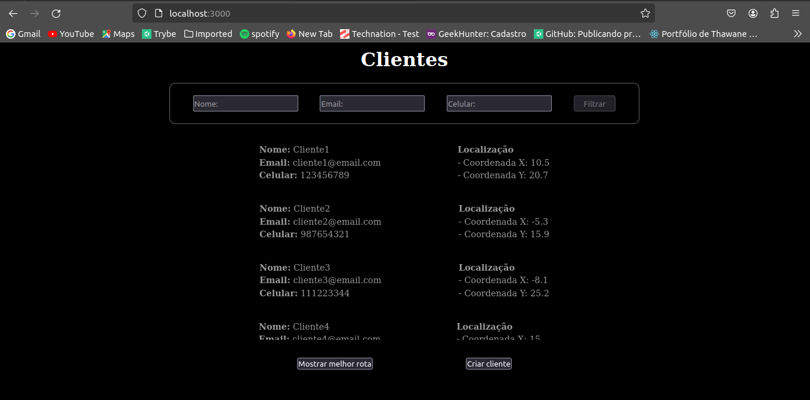

# Clients Manager
<!-- <a href="https://github.com/AllexThiagoSR/event-house-manager/blob/main/README-en.md" >English version</a> -->

  Um app fullstack que lista e adiciona clients, e calcula uma rota que visita todos os clientes e volta à empresa. 

## Requerimentos

- Git
- Docker
- Node v18.17.1 ou superior

## Instalação

Siga este passo a passo para testar este repositório.

Clone o repositório para sua máquina local

```
$ git clone git@github.com:AllexThiagoSR/teste-tecnico-cadastro-de-clientes.git
```

Acesse a pasta

```
$ cd teste-tecnico-cadastro-de-clientes
```

Acesse a branch onde o projeto está implementado se não estiver nela

```
$ git checkout main
```

> Caso não tenha o docker instalado, segue documentação para instalação: https://docs.docker.com/engine/install/ . Docker compose: https://docs.docker.com/compose/install/

## Iniciar a aplicação - Docker compose

Inicie os containers com o Docker Compose

```
$ docker compose up -d --build
```

Confira se os containers estão rodando

```
$ docker ps
```

O retorno do comando anterior deve ser mais ou menos o seguinte:

```
CONTAINER ID   IMAGE                                        COMMAND                  CREATED          STATUS          PORTS                                       NAMES
952a50964ed3   teste-tecnico-cadastro-de-clientes-backend   "npm run dev"            31 minutes ago   Up 31 minutes   0.0.0.0:3001->3001/tcp, :::3001->3001/tcp   api
466b959bc89b   postgres                                     "docker-entrypoint.s…"   31 minutes ago   Up 31 minutes   0.0.0.0:5432->5432/tcp, :::5432->5432/tcp   database
```

Entre na pasta frontend e rode o comando "npm start"

```
$ cd frontend && npm run start
```

Este comando vai buildar a página web e expôr na porta 3000 do localhost.

## Iniciar a aplicação com script(Ainda são necessários o Docker e o Docker-compose)

Entrar na pasta raiz do repositório e rodar o comando "npm start".

```
$ npm start
```

Este comando já executa o docker compose e roda a página web.


## Finalizar a aplicação

Para finalizar a aplicação primeiro você deve encerrar o frontend, utilizando o atalho "ctrl + c" no linux ou simplesmente encerrar o terminal onde está rodando o frontend.

```
$ > frontend@0.1.0 start
$ > next start

$ - ready started server on 0.0.0.0:3000, url: $ http://localhost:3000
$ - info Loaded env from /home/allex/Trybe/portifolio/teste-tecnico-cadastro-de-clientes/frontend/.env
```

E para finalizar os containers rodar o comando "npm run shutdown".

```
$ npm run shutdown

> teste-tecnico-cadastro-de-clientes@1.0.0 shutdown
> docker compose down

[+] Running 3/3
 ✔ Container api                                       Removed                                                          2.4s 
 ✔ Container database                                  Removed                                                          2.6s 
 ✔ Network teste-tecnico-cadastro-de-clientes_default  Removed 
```

## Como utilizar?

1. Cetifique-se de seguir todos os passos de instalação.

Após os passos anteriores a API estará exposta na porta 3001 do localhost e a página na porta 3000 localhost. É possível acessar a API atráves do link base `http://localhost:3001/api/`. É possível acessar a página web atráves do link `http://localhost:3000/`

## Tecnologias utilizadas

- JavaScript

- Docker

- Node.js

- Express

- PostgresSQL

# Endpoints da API

>Url base: http://localhost:3001/api/

## Listar todos os clientes
  Nessa rota é possivel enviar query params para filtrar a resposta final.

  ex: http://localhost:3001/api/clients?q=All
  
  Isso vai trazer do servidor todos os clientes que têm a sequência de caracteres "All" no nome.

### Requisição

`GET /clients`

    http://localhost:3001/api/clients

### Resposta

  Status 200 OK
```json
[
	{
		"id": 1,
		"name": "Cliente1",
		"email": "cliente1@email.com",
		"phone": "123456789",
		"x": 10.5,
		"y": 20.7
	},
	{
		"id": 2,
		"name": "Cliente2",
		"email": "cliente2@email.com",
		"phone": "987654321",
		"x": -5.3,
		"y": 15.9
	},
	{
		"id": 3,
		"name": "Cliente3",
		"email": "cliente3@email.com",
		"phone": "111223344",
		"x": -8.1,
		"y": 25.2
	},
  ...
]
```

## Gerar uma rota para visitar todos os clientes
  Nessa rota usando um algoritmo que implementa a heurística do vizinho mais próximo, e outro algoritmo que implementa a heurística de melhoria 2-opt, é criada uma rota inicial e feita modificações na mesma para tentar deixá-la mais eficiente. O retorno da rota é uma lista com o inicio e o fim sendo o ponto 0(a empresa) e o meio sendo a ordem que os clientes devem ser visitados.

### Requisição

`GET /clients`

    http://localhost:3001/api/clients/route

### Resposta

  Status 200 OK
```json
[
	{
		"id": 0,
		"name": "Empresa",
		"x": 0,
		"y": 0
	},
	{
		"id": 7,
		"name": "Cliente7",
		"email": "cliente7@email.com",
		"phone": "999888777",
		"x": "3.5",
		"y": "-5.9"
	},
	{
		"id": 9,
		"name": "Cliente9",
		"email": "cliente9@email.com",
		"phone": "777888999",
		"x": "6.7",
		"y": "-8.2"
	},
	{
		"id": 15,
		"name": "Cliente15",
		"email": "cliente15@email.com",
		"phone": "333222111",
		"x": "11.2",
		"y": "-6.4"
	},
	{
		"id": 4,
		"name": "Cliente4",
		"email": "cliente4@email.com",
		"phone": "554433221",
		"x": "15.0",
		"y": "-10.5"
	},
	{
		"id": 8,
		"name": "Cliente8",
		"email": "cliente8@email.com",
		"phone": "123987654",
		"x": "32.0",
		"y": "2.0"
	},
	{
		"id": 1,
		"name": "Cliente1",
		"email": "cliente1@email.com",
		"phone": "123456789",
		"x": "10.5",
		"y": "20.7"
	},
	{
		"id": 11,
		"name": "Cliente11",
		"email": "cliente11@email.com",
		"phone": "444555666",
		"x": "9.8",
		"y": "21.1"
	},
	{
		"id": 5,
		"name": "Cliente5",
		"email": "cliente5@email.com",
		"phone": "9876543241",
		"x": "7.3",
		"y": "18.6"
	},
	{
		"id": 13,
		"name": "Cliente13",
		"email": "cliente13@email.com",
		"phone": "222333444",
		"x": "5.1",
		"y": "14.7"
	},
  ...
	{
		"id": 0,
		"name": "Empresa",
		"x": 0,
		"y": 0
	}
]
```

## Criar um cliente
  Esse permite inserir um cliente no banco de dados. Os dados x e y representam a localização do cliente em um plano cartesiano.

### Requisição

`POST /clients`

    http://localhost:3001/api/clients

    body: {
      "name": "Client Name",
      "email": "clientname@gmail.com",
      "phone": "9999999999",
      "x": 3.4
      "y": -25.0
    }

### Resposta
  
  Status 201 CREATED


```json
{
  "id": 4,
  "name": "Client Name",
  "email": "clientname@gmail.com",
  "phone": "9999999999",
  "x": 3.4,
  "y": -25.0
}
```

# Páginas do site
  O site só tem uma página que é a principal onde nela há:
  - A lista de clientes cadastrados;
  - Um formulário para filtrar esta lista;
  - Um botão para gerar a rota;
  - Um botão para abrir um formulário de inserção de clientes.


<br></br>